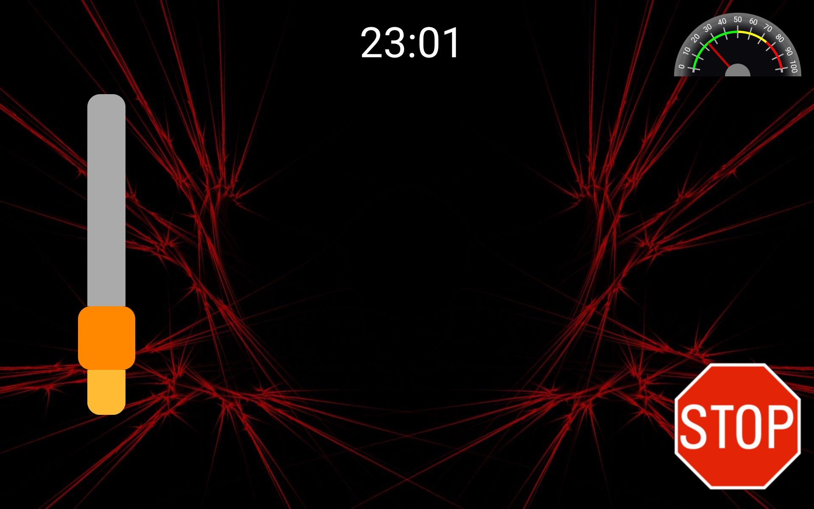

# WiFi Airplante Remote Control App (Android)
Controls a self built airplane over wifi socket server
------------

### Table of contents: 📝

1. Project information/explanation
2. Screenshots
3. How to use
4. Programmatic implementation

------------

### Project information/explanation

💡 With this Android app, our self-built aircraft can be controlled remotely from a school project. The application is programmed in Java and establishes a connection via a TCP socket server to send commands to the aircraft over a distance of up to 100 meters.

### Screenshots 🖼️

  
 Click to expand

  

### How to use ❓
1. Start the plane by connecting a power source
2. Wait about 30 seconds until the NodeMCU is fully up and running
3. Connect to the WiFi called `Arduino_Airplane`
4. Start/Restart the application
5. On the left hand  side is the speed controller
6. By tilting the device verticaly, you can adust the height
7. By tilting the device horizontaly, you can adust the direction

### Programmatic implementation 💻
The entire app is programmed in Android Studio using the Java programming language and the build automation tool gradle. It consists of two different app activities that can be switched by tilting the device.
The aircraft has an Arduino NodeMCU programmed in C++. It builds its own open Wifi Access Point and opens port 1337. All packets that arrive at the Arduino via this TCP socket are passed on to the engine control to tilt the wings and determine the engine speed.
This is what a single package looks like in plain text: `95,120,30\n`

When starting the app, the Android app determines the standard WiFi gateway and sends a packet with all the movement data every 100 milliseconds after the connection is established.
